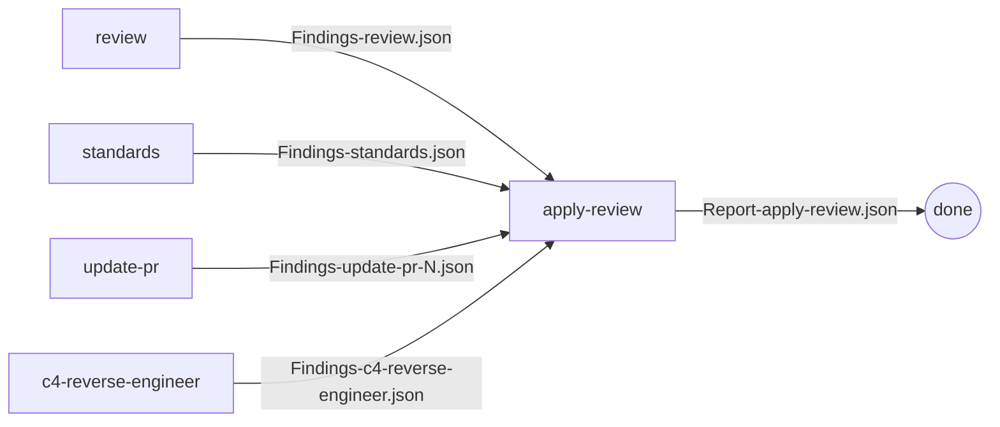

# jewzaam-reviews

A Claude Code plugin bundling a connected pipeline of review skills. Producer skills emit `Findings-<skill-name>[-<scope>].json` (validated against `schemas/findings.schema.json`) plus a script-rendered `.md` companion; `apply-review` consumes the JSON, applies each finding as an isolated commit, and emits `Report-apply-review.json` summarizing what happened.

## Skills

| Skill | Output files | Description |
|-------|--------------|-------------|
| `jewzaam-reviews:review` | `Findings-review[-<scope>].{json,md,-supplementary.md}` | Multi-agent codebase review across parallel dimensions |
| `jewzaam-reviews:standards` | `Findings-standards.{json,md,-supplementary.md}` | Audit repos against `~/source/standards/` personal standards library |
| `jewzaam-reviews:update-pr` | `Findings-update-pr-<number>.{json,md}` | Fetch GitHub PR review comments and supplementary feedback |
| `jewzaam-reviews:c4-reverse-engineer` | `Findings-c4-reverse-engineer.{json,md}` | Reverse-engineer C4 architecture diagrams and behavioral spec from a codebase |
| `jewzaam-reviews:apply-review` | `Report-apply-review.json` | Consume any `Findings-*.json`, apply as one-commit-per-finding, emit an action report |

## Installation

```bash
/plugin marketplace add jewzaam/jewzaam-reviews
/plugin install jewzaam-reviews@jewzaam/jewzaam-reviews
```

## Permissions

Skills invoke Python and Bash scripts from the plugin cache. To avoid repeated permission prompts, add these to your global (`~/.claude/settings.json`) or project (`.claude/settings.json`) allowlist:

```json
{
  "permissions": {
    "allow": [
      "Bash(bash ~/.claude/plugins/cache/jewzaam-reviews/**)",
      "Bash(python ~/.claude/plugins/cache/jewzaam-reviews/**)",
      "Bash(python3 ~/.claude/plugins/cache/jewzaam-reviews/**)",
      "Bash(~/.claude/plugins/cache/jewzaam-reviews/**)",
      "Read(~/.claude/plugins/cache/jewzaam-reviews/**)",
      "Read(~/.claude/plugins/marketplaces/jewzaam-reviews/**)"
    ]
  }
}
```

## Pipeline



## Usage

From any project repo:

```
/jewzaam-reviews:review                 # Multi-dimensional codebase review
/jewzaam-reviews:standards              # Audit against ~/source/standards/
/jewzaam-reviews:update-pr              # Pull PR review comments
/jewzaam-reviews:c4-reverse-engineer    # Generate C4 diagrams + spec
/jewzaam-reviews:apply-review           # Apply any Findings-*.json
```

## Filename convention

Two document types, two prefixes:

- **`Findings-<skill-name>[-<scope>].{json,md[,-supplementary.md]}`** — produced by the four producer skills. "Findings" because these are things the reviewer found in the user's code.
- **`Report-apply-review.json`** — produced by apply-review. "Report" because it summarizes actions taken, not findings. No markdown (no user-facing review document).

Filenames carry the skill name, not the project name. Project identity lives inside the JSON envelope's `project.name` field (the working directory is the project, so repeating it in every filename was redundant). Scope suffixes are used when a skill supports multiple scoped runs (e.g., PR numbers for `update-pr`, scope slugs for `review`).

## Shared handoff schema

All producer and consumer skills validate their JSON against `schemas/findings.schema.json`. The schema discriminates on a top-level `source` field (`review` / `standards` / `c4-reverse-engineer` / `apply-review`) and carries a uniform `issues[]` array for meta-issues from the run. `update-pr` is absent from the enum by design — it emits review-shaped findings with optional `pr_comment` fields, under `source: "review"`. See `CLAUDE.md` for the invariants and `resources/handoff-contract.md` for the full contract.

## License

Apache-2.0
