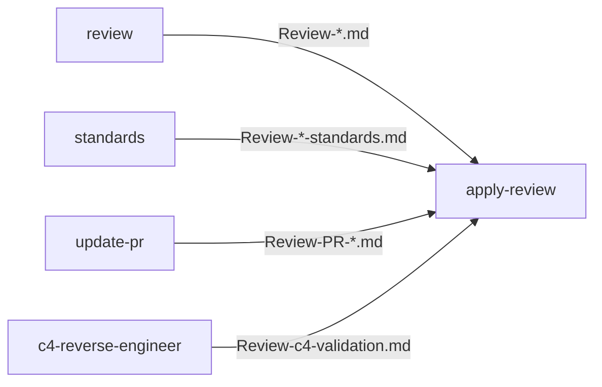

# jewzaam-reviews

A Claude Code plugin bundling a connected pipeline of review skills. Findings skills produce standardized `Review-*.md` files; `apply-review` consumes them and implements findings as one-commit-per-finding with validation.

## Skills

| Skill | Description |
|-------|-------------|
| `jewzaam-reviews:review` | Multi-agent codebase review across 5 parallel dimensions; outputs `Review-<project>.md` |
| `jewzaam-reviews:standards` | Audit repos against `~/source/standards/` personal standards library; outputs `Review-<project>-standards.md` |
| `jewzaam-reviews:update-pr` | Fetch GitHub PR review comments and supplementary feedback; outputs `Review-PR-<number>.md` |
| `jewzaam-reviews:c4-reverse-engineer` | Reverse-engineer C4 architecture diagrams and behavioral spec from a codebase; outputs `Review-c4-validation.md` |
| `jewzaam-reviews:apply-review` | Consume any `Review-*.md` and apply findings as one-commit-per-finding with validation |

## Installation

```bash
/plugin marketplace add jewzaam/jewzaam-reviews
/plugin install jewzaam-reviews@jewzaam/jewzaam-reviews
```

## Pipeline



## Usage

From any project repo:

```
/jewzaam-reviews:review                 # Multi-dimensional codebase review
/jewzaam-reviews:standards              # Audit against ~/source/standards/
/jewzaam-reviews:update-pr              # Pull PR review comments
/jewzaam-reviews:c4-reverse-engineer    # Generate C4 diagrams + spec
/jewzaam-reviews:apply-review           # Apply any Review-*.md findings
```

## License

Apache-2.0
