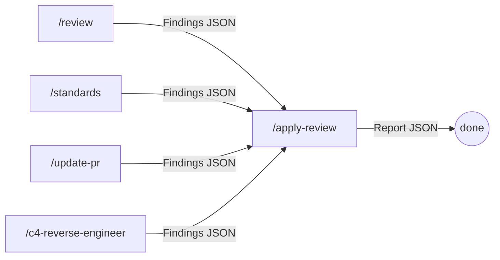
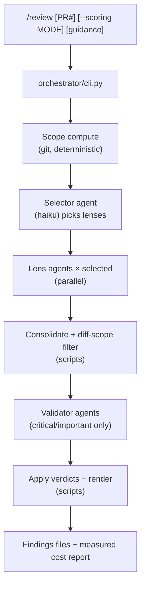

# jewzaam-reviews

A Claude Code plugin bundling a connected pipeline of review skills. Producer skills emit `Findings-<skill-name>[-<scope>].json` (validated against `schemas/findings.schema.json`) plus a script-rendered `.md` companion; `apply-review` consumes the JSON, applies each finding as an isolated commit, and emits `Report-apply-review.json` summarizing what happened.

## Skills

| Skill | Output files | Description |
|-------|--------------|-------------|
| `jewzaam-reviews:review` | `Findings-review[-<scope>].{json,md,-supplementary.md}` | Scope-aware multi-agent review via the script orchestrator |
| `jewzaam-reviews:standards` | `Findings-standards.{json,md,-supplementary.md}` | Audit repos against `~/source/standards/` personal standards library |
| `jewzaam-reviews:update-pr` | `Findings-update-pr-<number>.{json,md}` | Fetch GitHub PR review comments and supplementary feedback |
| `jewzaam-reviews:c4-reverse-engineer` | `Findings-c4-reverse-engineer.{json,md}` | Reverse-engineer C4 architecture diagrams and behavioral spec from a codebase |
| `jewzaam-reviews:apply-review` | `Report-apply-review.json` | Consume any `Findings-*.json`, apply as one-commit-per-finding, emit an action report |

## Installation

```bash
/plugin marketplace add jewzaam/jewzaam-reviews
/plugin install jewzaam-reviews@jewzaam-reviews-marketplace
```

## Permissions

Skills invoke Python and Bash scripts from the plugin cache. To avoid repeated permission prompts, add these to your global (`~/.claude/settings.json`) or project (`.claude/settings.json`) allowlist:

```json
{
  "permissions": {
    "allow": [
      "Bash(bash ~/.claude/plugins/cache/jewzaam-reviews-marketplace/**)",
      "Bash(python ~/.claude/plugins/cache/jewzaam-reviews-marketplace/**)",
      "Bash(python3 ~/.claude/plugins/cache/jewzaam-reviews-marketplace/**)",
      "Bash(~/.claude/plugins/cache/jewzaam-reviews-marketplace/**)",
      "Read(~/.claude/plugins/cache/jewzaam-reviews-marketplace/**)",
      "Bash(bash ~/.claude/plugins/marketplaces/jewzaam-reviews-marketplace/**)",
      "Bash(python ~/.claude/plugins/marketplaces/jewzaam-reviews-marketplace/**)",
      "Bash(python3 ~/.claude/plugins/marketplaces/jewzaam-reviews-marketplace/**)",
      "Bash(~/.claude/plugins/marketplaces/jewzaam-reviews-marketplace/**)",
      "Read(~/.claude/plugins/marketplaces/jewzaam-reviews-marketplace/**)"
    ]
  }
}
```

The review orchestrator additionally invokes the `claude` CLI headlessly (`claude -p`) to run its reasoning agents; it uses your existing Claude Code authentication.

## Pipeline Overview


```mermaid
graph LR
    review["/review"] -->|Findings JSON| apply["/apply-review"]
    standards["/standards"] -->|Findings JSON| apply
    updatepr["/update-pr"] -->|Findings JSON| apply
    c4["/c4-reverse-engineer"] -->|Findings JSON| apply
    apply -->|Report JSON| done((done))
```

## Review Skill Architecture

The review skill is a thin wrapper around a standalone Python orchestrator (`orchestrator/cli.py`). The orchestrator owns the whole pipeline deterministically; models are invoked only for reasoning, as headless `claude -p` agents with harness-enforced JSON schemas (`--json-schema`).


```mermaid
graph TD
    A["/review [PR#] [--scoring MODE] [guidance]"] --> B["orchestrator/cli.py"]
    B --> C["Scope compute<br/>(git, deterministic)"]
    C --> D["Selector agent<br/>(haiku) picks lenses"]
    D --> E["Lens agents × selected<br/>(parallel)"]
    E --> F["Consolidate + diff-scope filter<br/>(scripts)"]
    F --> G["Validator agents<br/>(critical/important only)"]
    G --> H["Apply verdicts + render<br/>(scripts)"]
    H --> I["Findings files + measured cost report"]
```

Key properties:

- **Scope-aware sizing.** A cheap selector agent reads the diff (or repo shape) and picks applicable lenses from a roster with `runs_when` descriptions. The `implementation` lens always runs; a broken selector falls back to all seven lenses rather than silently narrowing the review. A small PR typically runs 1 selector + 2–4 lens agents + a validator, instead of a fixed matrix.
- **Deterministic everything else.** Consolidation, diff-scope filtering, batching, verdict application, severity mapping, and rendering are tested Python scripts. The orchestrator sequences them; no model reasoning is involved.
- **Measured cost.** Every headless agent result carries `total_cost_usd`. The orchestrator writes a per-stage ledger to `.tmp-review/costs.json` and prints a cost table after each run — real spend, never estimates.
- **Validator pass.** Critical and important findings get an adversarial validator agent (premise check, dimensional/severity check, and PR-attribution check against the merge base for PR reviews). Verdicts are confirm / rescore / remove with an auditable removal trail in `issues[]`.

### Scoring modes

`--scoring` selects how findings are rated:

| Mode | Rating | Trade-off |
|------|--------|-----------|
| `categorical` (default) | Five categorical dimensions (`runtime_scope`, `failure_mode`, `evidence_quality`, `trace_origin`, `effort_to_fix`), each with a justification; severity buckets derived deterministically | More output tokens per finding; strongest noise filtering |
| `simple` | Direct `severity` (critical/important/suggestion) + `confidence` (high/medium/low); low confidence renders as needs-review | Cheaper and lighter; relies on the agent's direct judgment |

Each run's cost table shows what the chosen mode actually cost, so the trade-off can be compared with real numbers across runs.

## Severity Mapping (categorical mode)

Findings carry five categorical dimensions. The renderer maps them deterministically to severity buckets:

| Bucket | ID Prefix | Criteria |
|--------|-----------|----------|
| Critical | C | `demonstrated` + `entry-point` + `service-external` + `data-loss-or-security`/`crash-or-outage` |
| Important | I | `demonstrated`/`inferred` + `component`/`entry-point` + service scope + severe failure modes |
| Suggestion | S | Everything else that isn't speculative |
| Needs-review | N | `evidence_quality = speculative` (unvalidated by default) |

In simple mode, severity comes directly from the agents (validated for critical/important), and `confidence = low` maps to Needs-review.

## Usage

From any project repo:

```
/jewzaam-reviews:review                          # Full-repo review, scope-aware lens selection
/jewzaam-reviews:review 42                       # PR-scoped review (PR #42)
/jewzaam-reviews:review focus on auth            # Guided review
/jewzaam-reviews:review 42 --scoring simple      # PR review with simple scoring
/jewzaam-reviews:standards                       # Audit against ~/source/standards/
/jewzaam-reviews:update-pr                       # Pull PR review comments
/jewzaam-reviews:c4-reverse-engineer             # Generate C4 diagrams + spec
/jewzaam-reviews:apply-review                    # Apply any Findings-*.json
```

The orchestrator also runs standalone (useful outside Claude Code or from other agent frontends):

```
python <plugin-root>/orchestrator/cli.py --pr 42 --scoring simple
python <plugin-root>/orchestrator/cli.py --dry-run    # scope + selector prompt, no agents
```

## Filename convention

Two document types, two prefixes:

- **`Findings-<skill-name>[-<scope>].{json,md[,-supplementary.md]}`** — produced by the four producer skills. "Findings" because these are things the reviewer found in the user's code.
- **`Report-apply-review.json`** — produced by apply-review. "Report" because it summarizes actions taken, not findings. No markdown (no user-facing review document).

Filenames carry the skill name, not the project name. Project identity lives inside the JSON envelope's `project.name` field (the working directory is the project, so repeating it in every filename was redundant). Scope suffixes are used when a skill supports multiple scoped runs (e.g., PR numbers for `update-pr`, `pr-N` or a guidance slug for `review`).

## Development

```
make help               # Show all targets
make install-dev        # Create .venv and install test dependencies (auto-run by check/test)
make check              # Run all checks (test + version-check + resolved schemas)
make test               # Run pytest across plugin + skills + orchestrator
make version-check      # Validate semver consistency
make version-bump-patch # Bump patch (e.g. 0.2.8 → 0.2.9)
make version-bump-minor # Bump minor (e.g. 0.2.8 → 0.3.0)
make version-bump-major # Bump major (e.g. 0.2.8 → 1.0.0)
```

## Shared handoff schema

All producer and consumer skills validate their JSON against `schemas/findings.schema.json`. The schema discriminates on a top-level `source` field (`review` / `standards` / `c4-reverse-engineer` / `apply-review`) and carries a uniform `issues[]` array for meta-issues from the run. Review envelopes may carry a `scoring` field (`categorical` when absent, or `simple`) that selects which finding shape applies. `update-pr` is absent from the enum by design — it emits review-shaped findings with optional `pr_comment` fields, under `source: "review"`. See `CLAUDE.md` for the invariants and `resources/handoff-contract.md` for the full contract.

## License

Apache-2.0
