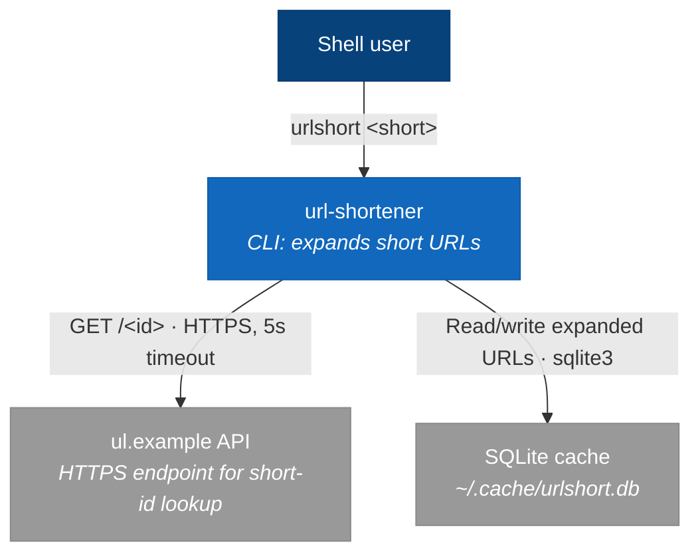
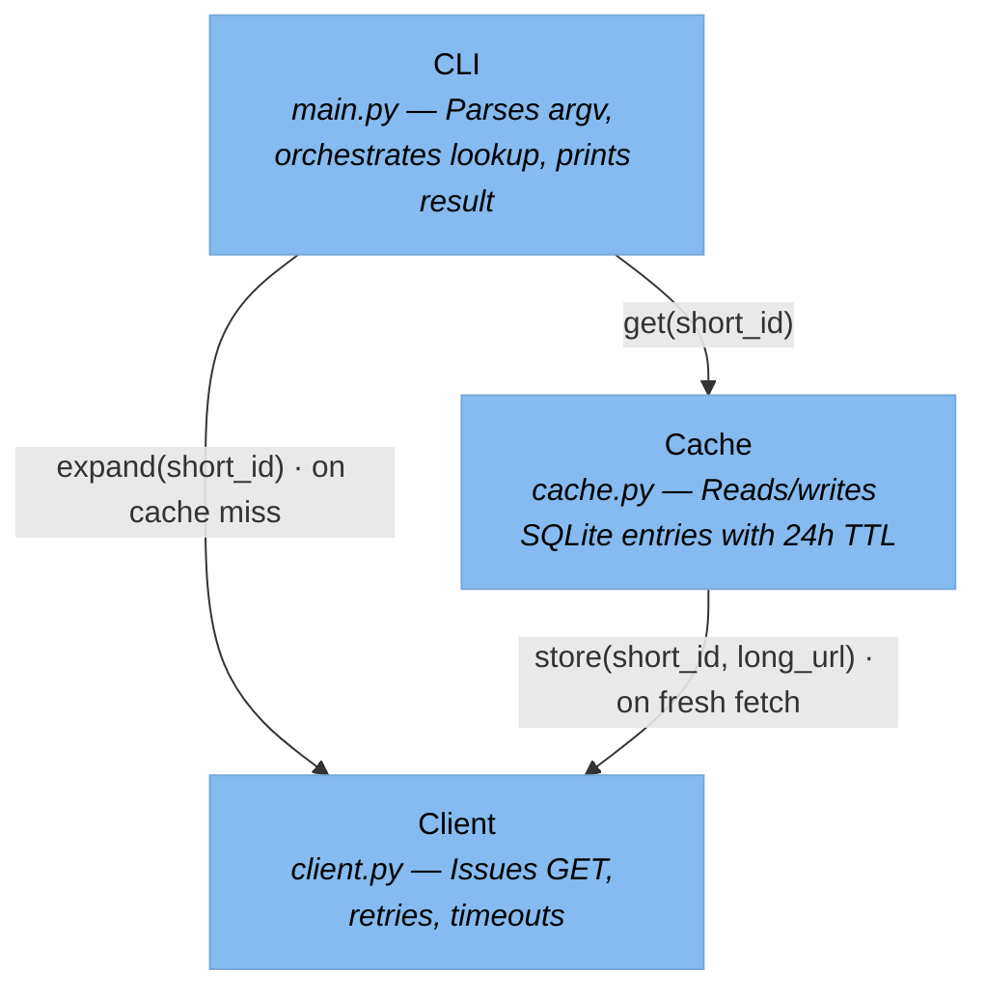

<!-- Generated By: Claude Code (Claude Opus 4.6) -->
# Example Output (Toy Project)

A minimal C4 doc set for a hypothetical `url-shortener` — a tiny CLI that expands a
short URL by hitting an API and prints the long form. Shown here to calibrate phrasing,
depth, and evidence standards for real runs.

The toy project:
- `main.py` — CLI entry point; takes a short URL, prints the expanded URL or an error
- `client.py` — HTTP client for `https://ul.example/<id>` (GET, 5s timeout, 3 retries)
- `cache.py` — local SQLite cache at `~/.cache/urlshort.db`; 24h TTL per entry

Phase 0 intake: purpose = "developer onboarding", artifact set = "full set".

---

## l1-c4-context.md (excerpt)

## l2-c4-container.md (excerpt)

Single process, single thread. Runtime containers:
- **CLI Process** — Python 3.11, exits after printing result
- **SQLite File** — on-disk store, opened per-invocation

## l3-c4-component.md (excerpt)

## behavioral-spec.md (excerpt — §9 Degradation)

### 9.1 API unavailable

`client.expand()` wraps `httpx.get(url, timeout=5)` in a retry loop (3 attempts, 1s
backoff between attempts — `client.py:34-48`). On all 3 failures, raises
`ExpansionError` which `main.py:22` catches and prints to stderr, exiting with code 2.

### 9.2 Cache read failure

`cache.get()` calls `sqlite3.connect(path)` inside a try/except for `sqlite3.Error`
(`cache.py:19`). On any exception, returns `None` — indistinguishable from a cache miss.
The CLI falls through to a live fetch.

### 9.3 Cache write failure

`cache.store()` uses the same try/except pattern. On failure, the write is dropped
silently and a warning is logged to stderr at `cache.py:41`. The expanded URL is still
returned to the user — cache failure does not block output.

---

## Phrasing notes (why this example is calibrated)

The §9 Degradation excerpt demonstrates the **mechanical phrasing** rule from Phase 5:

- "wraps `httpx.get(...)` in a retry loop (3 attempts, 1s backoff)" — describes what
  runs, not whether it's "robust" or "reliable".
- "returns `None` — indistinguishable from a cache miss" — explains the observable
  effect without calling it "safe" or "graceful".
- Every claim carries `file:line` evidence.
- No superlatives ("most reliable", "always catches", "correct handling").

A bad version of §9.1 might say: "The client robustly handles API failures by retrying
safely with exponential backoff." That sentence is 3 unverifiable adjectives
("robustly", "safely", "exponential" — the example uses linear backoff) and zero
evidence. The mechanical version can be fact-checked against the file.
